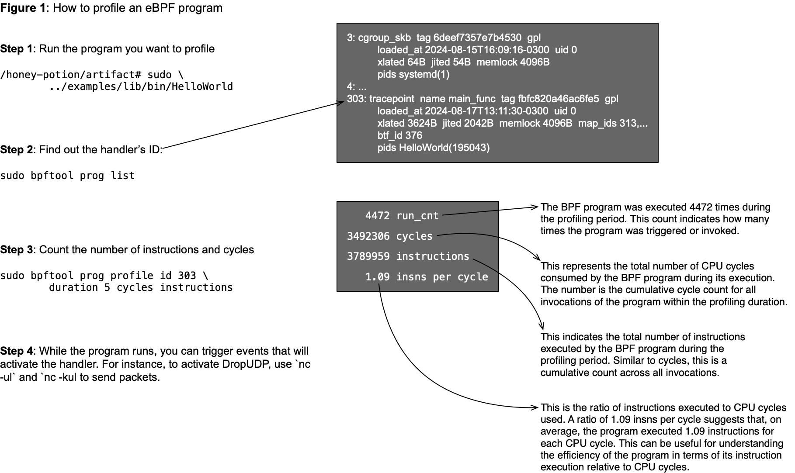

# Reproducing Research Question 3

Research Question Three (RQ3) compares the performance of [hand-written C programs](../../benchmarks) and [Elixir programs](../../examples/lib/) compiled via Honey Potion.
This is the only research question that we could not automatize with a single script.

## Running eBPF programs within Docker

To run the eBPF programs within Docker, then you should invoke Docker with sudo privileges, as follows:

```
docker run --rm -ti \
    -e BPF_IMAGE=docker-artifact \
    -v /var/run/docker.sock:/var/run/docker.sock \
    ghcr.io/hemslo/docker-bpf:latest \
    bash
```

You can run the programs using the same commands you would use outside Docker.
For instance, to count system calls, you can use the commands below.
This program, in particular, is the subject of one of our [videos](https://youtu.be/Q5GO-FFapVw?feature=shared):

```
# Compile everything, e.g., using rq2.sh:
#
root@docker:/honey-potion/artifact# bash rq2.sh 
#
# Run any of the programs:
#
root@docker:/honey-potion/artifact# sudo ../examples/lib/bin/CountSysCalls 
```

## Profiling eBPF programs outside Docker

If you have compiled the programs outside Docker (follow the instructions [here](../)), then measuring the performance of the BPF programs involves three steps:

1. (Within shell session 1) Activating the program, e.g.: `sudo honey-potion/examples/lib/bin/HelloWorld`
2. (Within shell session 2) Discovering the program's ID, e.g.: `sudo bpftool prog list`
3. (Within shell session 2) Profiling the program, e.g.: `sudo bpftool prog profile id 63 duration 5 cycles instructions` (assuming the ID is 63)

Figure 1 explains how to perform these steps.



Three of the programs can be profiled using the three first steps of Figure 1: [HelloWorld](../../examples/lib/HelloWorld.ex), [CountSysCalls](../../examples/lib/CountSysCalls.ex) and [ForceKill](../../examples/lib/Forcekill.ex).
In this case, use `duration 10` when invoking `bpftool prog profile`.

The other two programs, [DropUDP](../../examples/lib/DropUdp.ex) and [TrafficCount](../../examples/lib/TrafficCount.ex) will require some interaction.

* [DropUdp](../../examples/lib/DropUdp.ex): send a packet to port 3000 using `netcat`, as follows: `echo "Your message" | nc -u -w1 127.0.0.1 3000`
* [TrafficCount](../../examples/lib/TrafficCount.ex): use the `ping` command to send an ICMP packet to a known IP address on your network. This packet will be processed by the network interface and should trigger the eBPF program.
For instance, `ping -c 1 <destination_ip>`