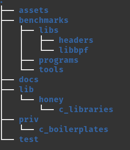

# Honey-Potion Documented

_This README specifies the folder structure of the project and the purpose of each of the folders. For more details on specific folders or files seek the .md with their names in this docs folder._

> _Picture may be outdated, please check folder structure or the written specification below_

> 
 
Pay extra attention to the folders of Examples if you are a user and Lib/Honey and Docs if you wish to become a contributor.

## Assets
Contains the logo of Honey-Potion and other images used for documentation.

## Benchmarks
Contains tools and examples for transforming C code into runnable eBPF programs. Divided into 3 folders:
### programs
Contains examples of C code that can be viewed as our "target" when using honey with an elixir project.
### libs
Contains the libraries for eBPF.
### tools
Contains the tools for eBPF.

## Lib/Honey
This is where the code for Honey-Potion resides. In other words, this is what does the process of turning an elixir code into a C counterpart. See Honey.md on this folder for more details.

### c_libraries
Contains the definitions of the sub-modules we translate to C. Depending on IDE this allows auto-complete.

### mix_methods
Contains code that is used when doing mix operations, like mix compile.

## Priv
Contains code that has to be persisted in the Hex documentation and contains the runtime functions and structures that represent basic elixir operations in C.

## Test
A folder generated by mix that isn't in use currently.

## Examples
A folder created to represent what a user of elixir would have. Contains the same behaviours as a user's folder when Elixir is added as a dependency. Look into here for examples of code and structures that can be translated.

## Docs
Contains the documentation of Honey-Potion project as an overview. Documentation of specific parts of code is currently handled with intuitive naming or comments.
